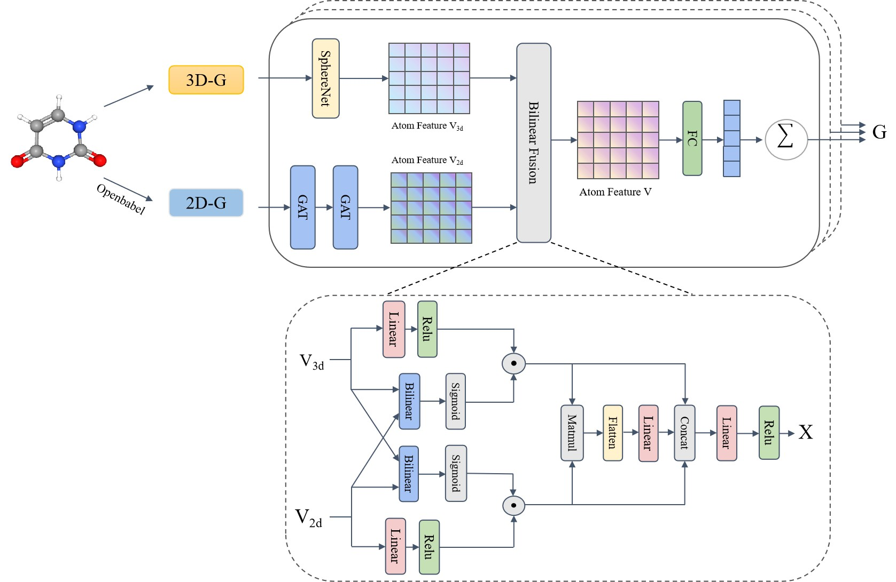

# MGRFN: Integrating Multiple Molecular Graph Representations for Molecular Property Prediction

## Framework

MGRFN is a Multi-Graph Representation Fusion Network (MGRFN) which employs Graph Attention Network and SphereNet to
extract 2D chemical features and 3D geometric information respectively, and use a bilinear fusion module to achieve
efficient integration of multimodal representations.

## Dependencies
* python==3.9
* pytorch==1.13.0+cu116
* torch-geometric==2.5.3
* rdkit==2023.9.5
* openbabel==3.1.1

## Usage

1. Process Data    
```shell script
python convert.py
python PygQM9.py
```

2. Molecular Property Prediction
```shell script
python QM9.py
``` 